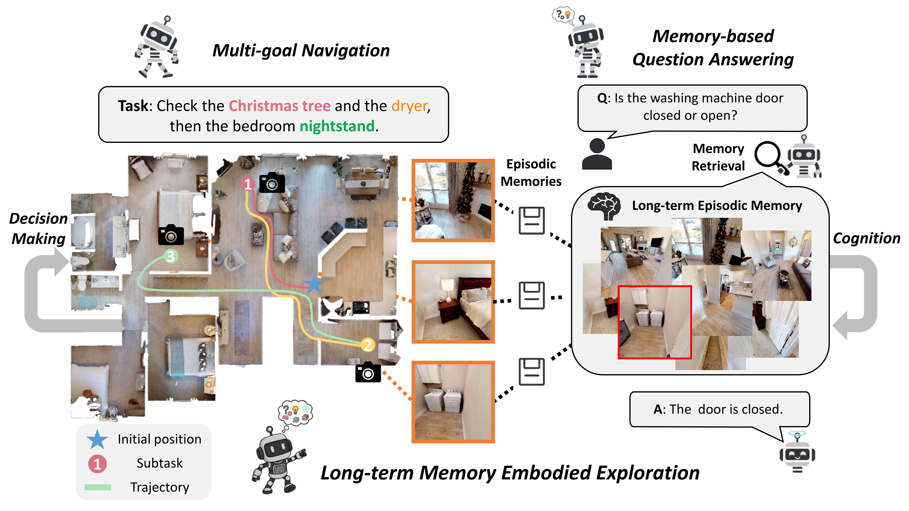

<br/>
<p align="center">
  <h1 align="center">Explore with Long-term Memory: A Benchmark and Multimodal LLM-based Reinforcement Learning Framework for Embodied Exploration</h1>
  <p align="center">
    CVPR 2026
  </p>
  <p align="center">
    Sen Wang,
    Bangwei Liu,
    Zhenkun Gao,
    Lizhuang Ma,
    Xuhong Wang,
    Yuan Xie,
    <a href="https://tanxincs.github.io">Xin Tan</a>
  </p>
  <p align="center">
    <a href="https://arxiv.org/abs/2601.10744">
      
    </a>
    <a href='https://wangsen99.github.io/papers/lmee/' style='padding-left: 0.5rem;'>
      
    </a>
  </p>
</p>

---

This is the official repository of **Explore with Long-term Memory**: A Benchmark and Multimodal LLM-based Reinforcement Learning Framework for Embodied Exploration.



---

## News

- [2026/03] Inference code for LMEE-Bench is released.
- [2026/02] Our paper is accepted to CVPR 2026!
- [2026/01] [Paper](https://arxiv.org/abs/2601.10744) is on arXiv.

## Preparations
Please download the train and val split of [HM3D](https://aihabitat.org/datasets/hm3d-semantics/)


## Evaluation
Please see [eval.md](evaluation\eval.md).

## Todo List
- Release training scripts and dataset
- Release data generation scripts

## Acknowledgement

The codebase is built upon [3D-Mem](https://github.com/UMass-Embodied-AGI/3D-Mem), and [MemoryEQA](https://github.com/memory-eqa/MemoryEQA).
We thank the authors for their great work.

## Citation

```tex
@inproceedings{wang2026explore,
  title={Explore with Long-term Memory: A Benchmark and Multimodal LLM-based Reinforcement Learning Framework for Embodied Exploration},
  author={Wang, Sen and Liu, Bangwei and Gao, Zhenkun and Ma, Lizhuang and Wang, Xuhong and Xie, Yuan and Tan, Xin},
  booktitle={Proceedings of the IEEE/CVF Computer Vision and Pattern Recognition (CVPR)},
  year={2026}
}
```
